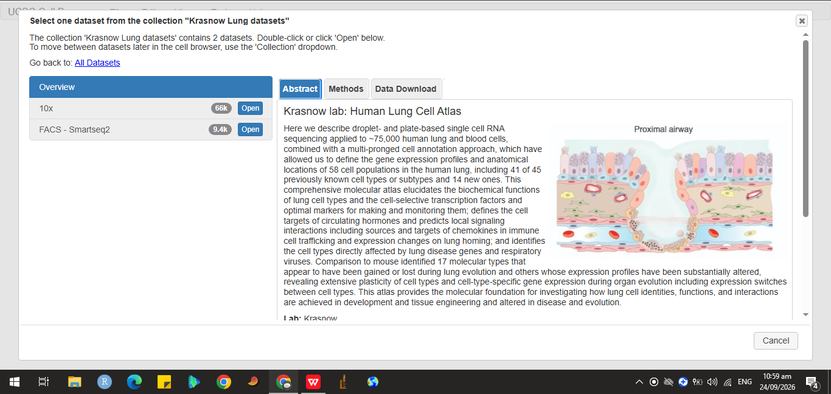
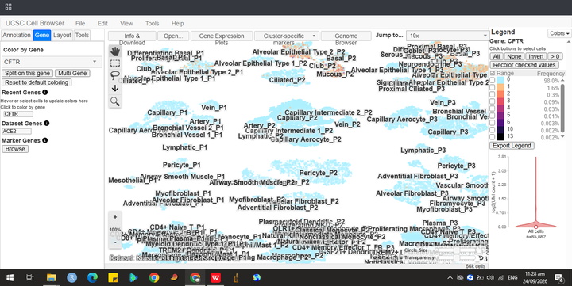
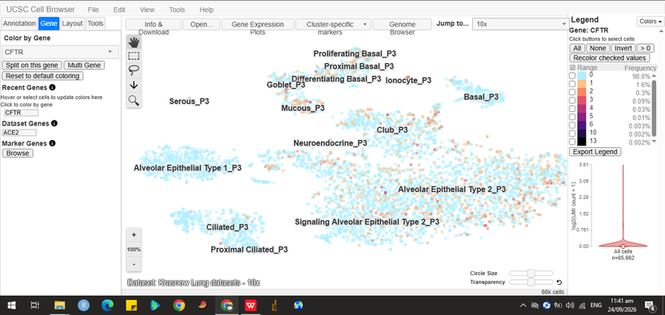
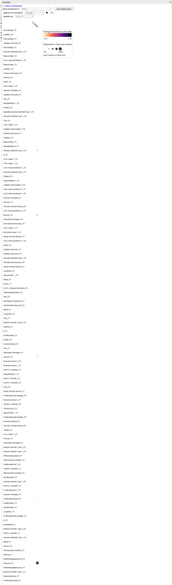
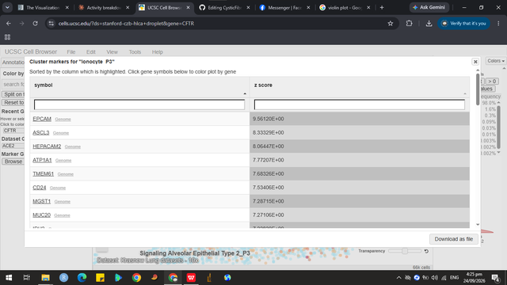

# UCSC Cell Browser Activity

**Name:** Isabella Tuble

**Assigned gene:** CFTR

**Associated disease:** Cystic fibrosis (CF)

### Open the UCSC Cell Browser and Choose a Dataset

**Dataset name:** Krasnow Lung datasets — 10x (Human Lung Cell Atlas, Travaglini et al.)

**Dataset URL:** https://cells.ucsc.edu/?ds=stanford-czb-hlca+droplet

**Organism:** Human (H. sapiens)

**Platform:** 10x Genomics (droplet-based scRNA-seq), 66k cells

**Organ/tissue relevance to CFTR/Cystic Fibrosis:**

CFTR is most directly associated with cystic fibrosis, a disease that primarily affects the lungs and airway epithelium. I selected a human lung/airway single-cell atlas because CFTR is expressed in airway epithelial cells, where it functions as a chloride channel that regulates mucus hydration. This dataset includes annotated airway epithelial cell types (basal, ciliated, club, mucous cells), making it well-suited to examine where CFTR is expressed at the single-cell level.

**Publication/Study:**

Travaglini et al., "A molecular cell atlas of the human lung from single cell RNA sequencing," *Nature* (2020) — Krasnow Lab, Stanford.

### Understanding the Cell Map

a. Visualization type: UMAP

b. One dot = one cell (in this case, one cell from the 10x droplet-based sequencing).

c. Clusters represent distinct cell types identified in the human lung (epithelial, immune, endothelial, stromal cell types)

d. Example cluster labels observed: Basal, Ciliated, Club, Mucous, Alveolar Epithelial Type 1, Alveolar Epithelial Type 2

### Assigned Gene Expression

a. Gene symbol: CFTR

b. Dataset: Krasnow Lung datasets – 10x (Human Lung Cell Atlas, Travaglini et al.)

c. Is expression widespread, restricted, or low/undetected?

Expression is low/restricted overall. According to the Cell Browser's expression frequency legend, 98% of all cells (n=65,662) show zero detectable CFTR expression, and only ~2% of cells show any signal at all. Where expression is detectable, it is concentrated in the airway epithelial region of the map rather than spread evenly across all cell types.

d. Which cluster(s) appear to contain cells with stronger expression?

The strongest signal (warm orange coloring) appears concentrated in the epithelial cluster region, particularly near the Proximal Basal, Goblet, and Serous/Mucous clusters (P3 patient group) — an area that also appears to include an annotated Ionocyte cluster, consistent with the known biology that rare pulmonary ionocytes are the dominant CFTR-expressing cell type in the airway.

e. Which cluster(s) appear to contain little or no detectable expression?

Nearly all non-epithelial clusters show little to no detectable expression, including capillary/vascular cells (Capillary, Artery, Vein, Bronchial Vessel), stromal cells (Pericyte, Fibroblast, Myofibroblast), and immune cells (T cells, B cells, Monocytes, Macrophages, Dendritic cells).

### Identify the Cell Types Expressing Your Gene

a. Cell type/cluster with the strongest visible expression: Club_P3 and Alveolar Epithelial Type 2_P3 (including "Signaling" AT2_P3) show the highest density of orange/red-colored cells.

b. Another cell type/cluster with detectable expression: Goblet_P3 and Ionocyte_P3 show some scattered detectable expression, though less dense than Club/AT2.

c. Cell type/cluster with relatively low or undetected expression: Alveolar Epithelial Type 1_P3 and Ciliated_P3/Proximal Ciliated_P3 show almost entirely pale blue (undetected) coloring.

d. Expression pattern: Cell-type restricted, concentrated within the airway/alveolar epithelial compartment rather than broad across all lung cell types.

**Interpretation based on the selected dataset**

CFTR's concentration in Club cells and Alveolar Epithelial Type 2 cells may reflect these cells' roles in secretory and surfactant-related functions, which could involve fluid and ion transport processes that CFTR, as a chloride channel, would support. The relatively low signal in Ciliated and Alveolar Epithelial Type 1 cells is consistent with their more structural/gas-exchange roles, which may rely less on CFTR-mediated chloride transport. However, since the well-known "ionocyte-dominant" CFTR pattern from other studies wasn't the clearest signal here, this may reflect differences in sequencing depth, capture efficiency, or the specific population sampled in this particular dataset rather than a contradiction of the broader biology.

### Expression Plot (Dot Plot)

a. Plot type used: Dot plot (CFTR expression split by cell_type)

b. Findings

The dot plot reveals that Ionocyte_P3 shows by far the strongest CFTR signal of any cluster — both the largest dot (highest percentage of cells with detectable expression) and the darkest color (highest average expression, approaching the top of the 0.00-2.45 scale). All other clusters, including Alveolar Epithelial Type 2_P3 and Club_P3/P2, show only small, faint dots by comparison.

c. What the dot plot adds beyond the UMAP

The UMAP's color-by-gene view gave the impression that Club and Alveolar Epithelial Type 2 cells had meaningful CFTR expression, since these are large clusters with many cells scattered with weak signal. The dot plot corrects this by normalizing for percent-expressing and average expression per cluster, revealing that Ionocytes — a very rare population — are actually the dominant CFTR-expressing cell type, consistent with published literature on pulmonary ionocytes.

### Marker Genes

**Cluster/cell type examined:** Ionocyte_P3

**Top marker genes (ranked by z-score)**
1. EPCAM — z ≈ 9.56 (general epithelial marker)

2. ASCL3 — z ≈ 8.33 (transcription factor specific to ionocyte differentiation)

3. HEPACAM2 — z ≈ 8.06

**Does CFTR behave like a cell-type marker in this dataset?**

No. CFTR was not among the top marker genes for the Ionocyte_P3 cluster, even though it showed the highest average expression of any cluster in the earlier dot plot analysis. This shows that a gene can be strongly and specifically expressed within a cell type without being one of the statistically top-ranked genes that distinguish that cluster from all others — marker rank reflects how uniquely a gene separates one cluster from the rest, not just its absolute expression level. This is consistent with the activity's point that a disease-relevant gene does not have to be a defining marker gene for a cell type.

### Disease Gene vs. Marker Gene

a. Assigned disease gene: CFTR

b. Marker gene: ASCL3

c. Which gene shows a more cell-type-restricted expression pattern? 

ASCL3 — its expression appears almost exclusively confined to the Ionocyte_P3 cluster, with little to no detectable signal in other epithelial or non-epithelial cell types.

d. Which gene appears more broadly expressed?

CFTR — while its strongest signal is also in Ionocyte_P3, it shows additional low-level, scattered expression across other epithelial clusters such as Club and Alveolar Epithelial Type 2, making its overall pattern broader and less cleanly restricted than ASCL3.

e. What does this comparison teach you about the difference between a disease-associated gene and a cell-type marker gene?

A cell-type marker gene like ASCL3 is defined by how uniquely and consistently it identifies one specific cluster, which makes it statistically useful for classification. A disease-associated gene like CFTR, by contrast, can have broader biological relevance and be expressed at meaningful levels across multiple related cell types, even if it isn't the single best "signature" gene for any one of them. Its importance to disease comes from its function, not from how specifically it marks a cell type.

**Confirmed via multi-gene dot plot (ASCL3 vs CFTR)**

Ionocyte_P3 shows strong dots for both genes, but ASCL3's color is darker (higher relative average expression) and appears in no other cluster. CFTR shows a smaller, lighter dot in Ionocyte_P3 plus additional faint dots scattered across Alveolar Epithelial Type 2, Club, Mucous, Basal, and Goblet clusters — visually confirming that CFTR is more broadly expressed while ASCL3 is essentially restricted to one cell type.

### Connection to Genome Browser and ClinVar

**1. Chromosome location:** 

CFTR is located on chromosome 7 (7q31.2), spanning approximately 189 kb, as identified in the previous UCSC Genome Browser activity.

**2. Disease-associated variant:**

F508del — NM_000492.4(CFTR):c.1521_1523delCTT (p.Phe508del), rs113993960, ClinVar Variation ID 7105. This is an in-frame 3-bp deletion in exon 11 that removes the codon for phenylalanine at position 508, classified as Pathogenic (reviewed by expert panel, 4-star rating).

**3. Cell type(s) expressing the gene (current Cell Browser dataset):**

In the Krasnow Lung Atlas (10x), CFTR shows its strongest, most specific expression in Ionocyte_P3, with additional lower-level expression detected in Club_P3 and Alveolar Epithelial Type 2_P3.

**4. Does the observed cell expression make biological sense?**

Yes. CFTR encodes a chloride channel required for regulating airway surface liquid and mucus hydration, and its expression is concentrated in ionocytes, a rare airway epithelial cell type identified in recent studies as a major site of CFTR activity. The F508del variant causes CFTR protein misfolding and degradation, which would be expected to disrupt chloride transport specifically in the cell types that depend on CFTR most, such as ionocytes and other secretory airway epithelial cells. This loss of function in CFTR-expressing cells is consistent with the thick, dehydrated mucus and airway obstruction characteristic of cystic fibrosis, linking the variant's molecular effect to a specific, biologically plausible cellular source.

**5. Can this single Cell Browser dataset prove that the gene causes the disease?**

No. This dataset shows where CFTR is expressed at the RNA level in single cells from a set of donor lung samples — it does not include the F508del mutation itself, functional chloride-transport data, or clinical outcome data. Expression location alone establishes correlation with a relevant cell type, not causation. As noted in the previous activity, proving that a variant causes disease requires additional evidence: functional protein studies, segregation analysis in families, population frequency data, and independent clinical case reports.

### Reflection

**1. What did the UCSC Cell Browser show you that the UCSC Genome Browser could not?**

The Genome Browser showed me where CFTR is located in the genome and where the F508del variant sits within its exon structure, but it couldn't tell me anything about which cells actually use the gene. The Cell Browser revealed that CFTR expression is concentrated in a specific, rare cell type (ionocytes) rather than spread evenly across all lung cells, connecting the gene's DNA-level location to its actual functional role in specific tissue.

**2. Why can the same gene have different expression levels among different cell types?**

Even though every cell in the body carries the same genome, different cell types turn different genes on or off depending on their specialized function, a process controlled by regulatory elements and transcription factors. CFTR is more strongly expressed in ionocytes because these cells are specialized for the ion-transport role that CFTR performs, while other cell types have little biological need for this channel and keep it largely silent.

**3. Why should you be careful when interpreting a gene that shows zero or very low expression in single-cell data?**

A "zero" in single-cell data doesn't necessarily mean a gene is truly absent — it can reflect technical limitations like shallow sequencing depth or low RNA capture efficiency (dropout), especially for genes that are expressed at naturally low levels, like CFTR. Concluding a gene is definitely "not expressed" based on a single dataset risks over-interpreting a technical artifact as a biological fact.

**4. Why is it useful to combine information about genomic location, genetic variants, and cell-specific gene expression?**

Each layer of information answers a different question: genomic location tells you where a gene sits and how it's structured, variant data tells you what specifically goes wrong at the molecular level, and cell-specific expression tells you which cells and tissues are actually affected by that molecular change. Combining all three gives a much more complete picture of how a single DNA change can lead to a disease phenotype in a specific organ.

**5. What was the most interesting observation you made about your assigned gene?**

The most interesting observation was that CFTR's strongest expression wasn't in a common, large cell population but in ionocytes, a rare cell type that makes up less than 1% of the cells in the lung dataset. Also striking was that CFTR showed up as the top-expressing gene in that cluster without being ranked among its top statistical marker genes, which was a clear, hands-on example of the distinction between a gene being important versus a gene being diagnostic for a cell type.

## References and Links

UCSC Cell Browser: https://cells.ucsc.edu/

Dataset used: https://cells.ucsc.edu/?ds=stanford-czb-hlca+droplet

UCSC Cell Browser Getting Started Guide: https://cellbrowser.readthedocs.io/en/master/ui/getting_started.html

Travaglini et al., "A molecular cell atlas of the human lung from single cell RNA sequencing," Nature (2020)

Previous activity (Genome Browser/ClinVar): https://github.com/tubleisabella-cellmol/CysticFibrosis-CFTR-bioinformatics

